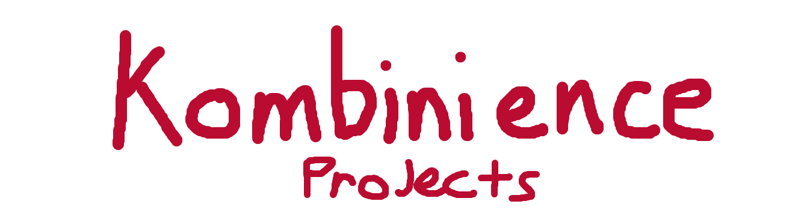
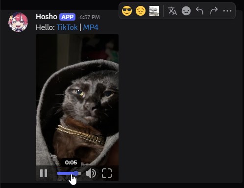
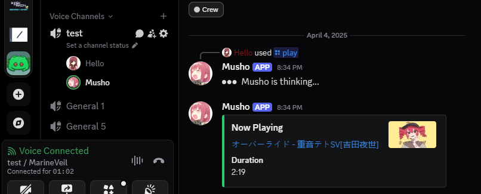
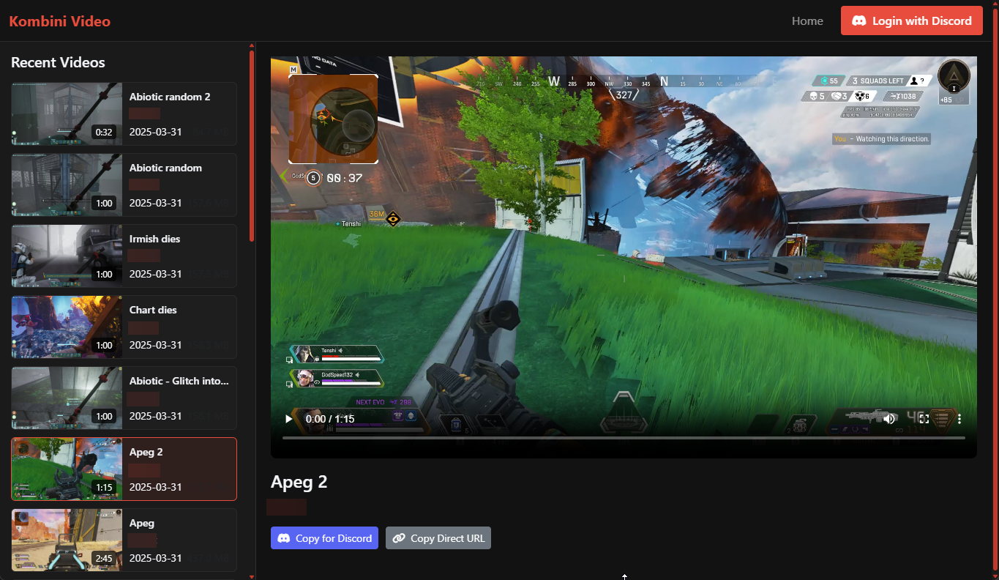

# Kombinience Projects

This repository contains a collection of interconnected projects focused on media handling, particularly for Discord bots and web-based video management stuff. Should this have been seperate repositories? Yeah probably.

## Projects Overview

### 1. Discord Bots

#### Hosho Embed Bot
A Discord bot that enhances media sharing by automatically downloading and re-embedding media from URLs posted by users (select few services that I hard coded in).

**Key Features:**
- Detects URLs in messages and downloads media content
- Direct message support (It cant delete your url though)
- Uploads media to AWS S3 for reliable hosting
- Creates embedable links that work properly in Discord
- Uses Cobalt API for primary downloads with yt-dlp as fallback
- Handles rate limiting and error recovery
- **Fully Dockerized** for easy deployment

#### Musho Music Bot
A feature-rich Discord music bot that plays audio from various sources within voice channels.

**Key Features:**
- Plays audio from YouTube and other supported platforms
- Supports playlists and queue management
- Volume control and playback management
- Can use YouTube cookies for authenticated playback (useful for datacenter IPs)
- Supports both yt-dlp and Cobalt for audio extraction (mainly using yt-dlp for the cookies setting)
- **Fully Dockerized** for easy deployment
- Note: if you don't setup yt-dlp with cookies and are on a datacenter/youtube-angery-ip, you will have to setup your cobalt appropriately to support youtube.
### 2. VidUploader Website (Work In Progress)

A web application for uploading, managing, and sharing videos with Discord integration. **This project is currently under development.**

**Key Features:**
- User authentication via Discord OAuth2
- Video upload with metadata extraction
- Thumbnail generation
- AWS S3 integration for video storage
- Responsive user interface for video browsing
- Personal video library management

## Setup & Installation

Each project has its own specific setup requirements. Check the `.env.example` files in each project directory for required configuration variables.

### Prerequisites

- Python 3.8+ (only if not using Docker)
- Docker and Docker Compose (recommended)
- AWS S3 bucket and credentials
- Discord bot tokens and application credentials
- Cobalt API instance (optional but recommended)

### Hosho Embed Bot Setup

#### Docker Method (Recommended):
1. Navigate to the `Discord_bots/Hosho_Embed_bot` directory
2. Copy `.env.example` to `.env` and fill in your credentials
3. Run `docker compose build`
4. Start the bot with `docker compose up -d`
5. View logs with `docker compose logs -f`

#### Manual Method:
1. Navigate to the `Discord_bots/Hosho_Embed_bot` directory
2. Copy `.env.example` to `.env` and fill in your credentials
3. Install dependencies: `pip install -r requirements.txt`
4. Run the bot: `python embedbot.py`

### Musho Music Bot Setup

#### Docker Method (Recommended):
1. Navigate to the `Discord_bots/Musho _Music_bot` directory
2. Copy `.env.example` to `.env` and fill in your credentials
3. Run `docker compose build`
4. Start the bot with `docker compose up -d`
5. View logs with `docker compose logs -f`
6. (Optional) Set up YouTube cookies with the `/setcookies` command in Discord

#### Manual Method:
1. Navigate to the `Discord_bots/Musho _Music_bot` directory
2. Copy `.env.example` to `.env` and fill in your credentials
3. Install dependencies: `pip install -r requirements.txt`
4. Run the bot: `python musicbot.py`
5. (Optional) Set up YouTube cookies with the `/setcookies` command in Discord

### VidUploader Website Setup (Work In Progress)

**Note: This project is still under development and doesn't have Docker containerization yet.**

1. Navigate to the `VidUploader_Upload_website` directory
2. Copy `.env.example` to `.env` and fill in your credentials
3. Install dependencies: `pip install -r requirements.txt`
4. Initialize the database: `flask init-db` (first time only)
5. Run the application: `sudo python app.py`

## Docker Deployment

Both Discord bots include Docker configuration for easy deployment:

Benefits of using Docker:
- No need to install Python or dependencies on your host system
- Consistent environment across different operating systems
- Easy updates and rollbacks
- Automatic restart on system reboot

## Cobalt API Integration

Both discord bots benefit from using the [Cobalt API](https://github.com/imputnet/cobalt) for enhanced media downloading capabilities. Cobalt provides better support for TikTok, Instagram, and other platforms that may be difficult to download from directly.

The bots are currently implemented to assume you have your own local cobalt api running, if you have something else in mind youre probably already capable enough to change how it works anyways.

## AWS S3 Configuration

All projects use AWS S3 for media storage. You'll need:
- An S3 bucket with appropriate permissions
- AWS access key ID and secret access key with S3 permissions
- Proper CORS configuration on your S3 bucket for web access

## License

This project is licensed under the MIT License - see the LICENSE file for details.

## Acknowledgments

- [yt-dlp](https://github.com/yt-dlp/yt-dlp) for video downloading capabilities
- [Cobalt API](https://github.com/imputnet/cobalt) for enhanced media extraction
- [Discord.py](https://github.com/Rapptz/discord.py) for Discord bot functionality
- [Flask](https://flask.palletsprojects.com/) for the web application framework